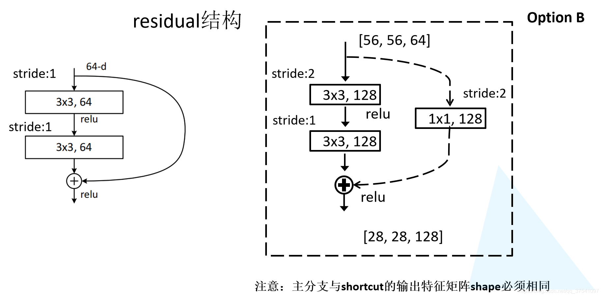
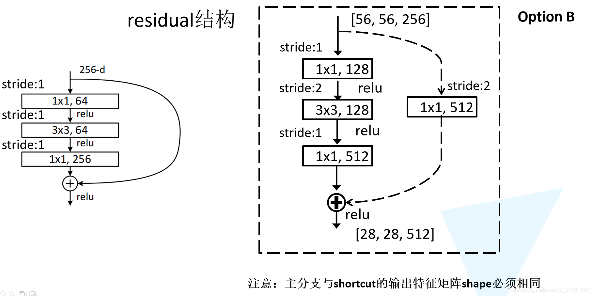
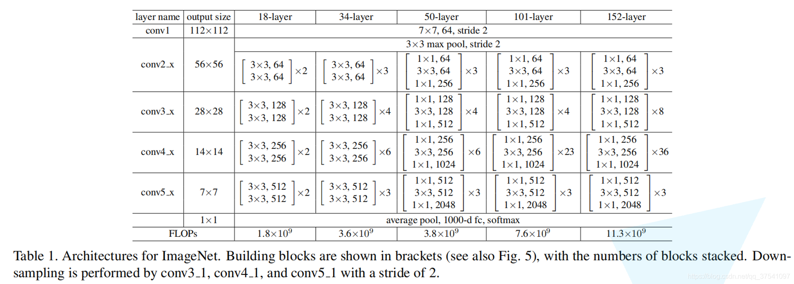
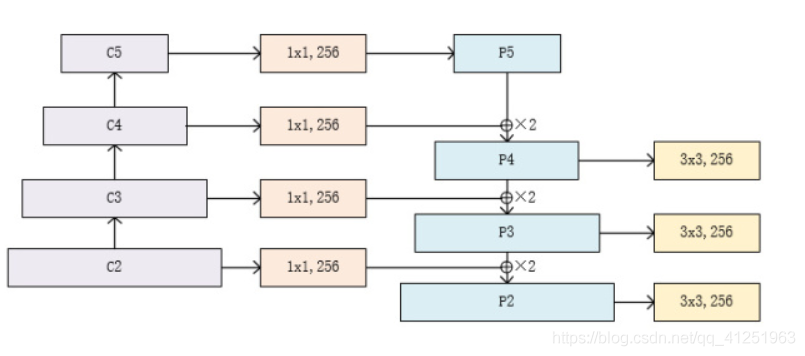

#### Tasks

##### 任务要求：实现 resnet，fpn，交叉熵损失，L1损失，dice loss，focal loss  ；了解信息熵和信号处理基本方法以及噪声相关的内容。

##### 损失函数

1. 基于距离度量

   1. MSE损失：
      $$
      loss = \frac{1}{n}\sum^N_{i=1}(yi-f(x_i))^2
      $$
   
   1. L2(MSE)损失：

      1. 欧氏距离，距离度量数据相似度；
   
      2. 凸性，可微性，独立同分布；
         $$
         loss = \sqrt{\frac{1}{n}\sum^N_{i=1}(yi-f(x_i))^2}
         $$

   1. L1(MAE)损失：

      1. 曼哈顿距离，表示残差绝对值之和；对离群点有很好的鲁棒性；但是具有缺点，残差为0处不可导，更新的梯度始终相等
      $$
         loss =\sum^N_{i=1}|y_i-f(x_i)|
      $$
   
   1. Smooth L1 损失：
   
      1. 在 Fast-RCNN提出的，防止梯度爆炸；
   
   $$
      loss = 
   \left\{
      		\begin{array}{**lr**}
      		\frac{1}{2}(y_i-f(x))^2,& \\
      		|y_i-f(x)| - \frac{1}{2},&
      		\end{array}
      \right.
   $$
   
1. 基于概率分布度量

   1. 相对熵/KL散度函数

      1. 度量两个概率分布之间的距离；
         $$
         loss =\sum^n_{i=1}y_i *log(\frac{y_i}{f(x_i)})
         $$
         

   1. 交叉熵损失

      1. 刻画了实际输出概率与期望输出概率之间的相似度，也就是交叉熵的值越小，两个概率分布就越接近，特别是在正负样本不均衡的分类问题中，常用交叉熵作为损失函数，可以有效避免梯度消散；
         $$
         CrossEntropyLoss =L(y,p)=-\frac{1}{N}\sum^N\limits_{i}\sum^M\limits_{c=1}y_{ic}\log (p_{ic})
         \\N为样本总数量，M为种类数量；
         \\如果样本i真实值等于c，则y_{ic}取1，否则取0，p_{ic}为对应的预测概率
         $$
         可以简化为
         $$
         loss = -\frac{1}{N}\sum^N_{i=1}y_i\log f(x_i)
         \\
         f(x_i)为预测概率，y_i为实际标签
         $$

      1. 可以添加参数，解决正负样本不平衡问题；

   1. dice loss

      1. dice coefficient是评估样本相似性的度量函数，取值在0到1之间；而dice loss可以表示为1-dice；实际上，dice 即为F1分数的表示，优化dice loss即为优化F1，即召回率与精确率的平衡；
         $$
         dice = \frac{2|X∩Y|}{|X|+|Y|}
         $$
         
      1. 应用场景：语义分割，正负样本强烈不平衡；

      1. 实现形式
         $$
         loss = 1-\frac{2I+\varepsilon}{U+\varepsilon}
         \\
         loss = 1-\frac{I+\varepsilon}{U-I+\varepsilon}
         \\
         I=\sum^N_1t_iy_i  \enspace
         U=\sum^N_1(t_i+y_i)
         \\
         其中t_i为预测的概率，y_i是种类的标签（0或者1），\varepsilon是平滑数，避免分子分母为0
         $$
         

   1. focal loss

      1. 场景：解决图像领域，样本不平衡造成的问题；gamma可以减小易分样本的损失贡献；可以考虑增加alpha调节正负样本损失的比例，可以微微提高效果；
         $$
         loss = \sum^N_{i=1} -(1-f(x_i))^{\gamma}\log f(x_i)
         \\
         \gamma 是可以调节的因子，p即为f(x)的预测结果
         $$
         

##### Resnet实现

1. 信息来源：参考Pytorch的resnet实现以及各类博客。

1. BasicBlock结构：

   

1. BottleNeck：

   

1. ResNet：

   

1. 实现测试：在 train.py 中，分别使用 resnet34 和 resnet50 ，参考一些resnet应用实现，成功替代了pytorch自带的resnet，顺利完成了训练。

##### FPN实现：

1. BackBones：bottleneck构成的ResNet架构；
1. P5,P4,P3,P2：横向连接+上采样，四层输出从上到下依次为：

   torch.Size([1, 256, 7, 7])
   torch.Size([1, 256, 14, 14])
   torch.Size([1, 256, 28, 28])
   torch.Size([1, 256, 54, 54])

   

##### 信息论及信号处理系统阅读：

1. 信息：是物质存在和运动形式的描述，与物质、能量构成客观世界的三大要素。

2. 通信系统：信源--~信息~-->编码器---~信号~->信道（干扰源干扰）-->译码器---~信息~->信宿

3. 信息量：信息多少的量度，不确定的量度。

   1. 自信息量：
      1. 公式为：-log(p(x~i~))

      2. 物理意义：一个随机事件所包含的信息量，或者说是一个事件的不确定度；一个事件发生的概率越小，信息量越大，说明不确定度越大。

      3. 条件自信息量：在y给定条件下，x的信息量。
   2. 互信息量：
      1. 物理意义：给定的y，对消除x的不确定度的度量；
      2. 公式为：自信息量-条件自信息量
      3. 性质：互易，可正可负可为零，
      4. 条件互信息量：

4. 信息熵：

   1. 自信息量表示单个字符的信息量度，对于整个信源，使用平均自信息量，即信息熵来衡量信息测度，或者说信源的不确定度。
   2. 信息不确定度的量度；

   $$
   p(x=x_i)=p_i(x)
   \\Entropy = - \sum p_i(x)\log p_i(x)
   $$

   1. 性质：对称，非负性，拓展性，可加性，极值性，确定性，上凸性，

5. 条件熵（损失熵，噪声熵）：

   1. 多个信源/概率空间之间的相互关系；例如，H(Y|X) 表示在已知输入 X 的情况下，输出信源 Y 剩余的不确定度为多少。

   2. 公式为
      $$
      H(Y|X=x_i)=-\sum_j p(y_j|x_i)\log p(y_j|x_i)
      \\
      H(Y|X) = - \sum p(xy)\log (p(y|x)) = -\sum_i \sum_j p(x_i)p(y_i|x_i)log(p(y_i|x_i))
      $$

6. 联合熵（共熵）：
   $$
   H(X，Y) = -\sum_{XY}p(x_iy_j)\log (p(x_iy_j))
   $$

7. 相互关系：

   1. 联合熵=信息熵+条件熵；
   2. 联合熵<=信息熵之和，等式成立条件是两个集合统计独立；

8. 加权熵：
   $$
   H_W(X) = \sum^n_i w_ip_i\log(1/p_i)
   $$

9. 信息源

   1. 离散无记忆信息源，连续无记忆信息源（统计独立）
   2. 有限记忆信源（马尔科夫信源）（时齐，时齐遍历），随机波形源，混合源；

10. 信号处理方法：

    1. 采样和量化：将连续时间信号转换为离散时间信号的过程称为采样，将连续振幅信号转换为离散振幅信号的过程称为量化，两者用以获取和表示信号。
    2. 滤波：滤波是通过将信号通过滤波器，去除不需要的部分并保留感兴趣的部分的过程。滤波通常分为时域滤波和频域滤波两种方式。
    3. 傅里叶变换：将时域信号转换为频域信号的过程称为傅里叶变换。傅里叶变换可以将信号分解为不同频率的成分，便于分析和处理。
    4. 小波变换：小波变换是一种多分辨率分析技术，可以将信号分解为不同尺度的小波基函数。小波变换在信号压缩、图像处理和数据挖掘中广泛应用。
    5. 信号增强：信号增强是通过对信号进行滤波、平滑和噪声去除等处理，使信号的质量得到提高的过程。信号增强常常用于提高信号的可读性和可理解性。
    6. 数据压缩：数据压缩是通过降低信号的冗余性和信息量，使信号占用的存储空间更少的过程。数据压缩可以分为有损压缩和无损压缩两种方式。
    
11. 信号噪声信息：

    1. 图像噪声特点：

       1. 随机性
       2. 相关性
       3. 叠加性

    2. 常见噪声类型：

       1. 概率分布分类
          1. 白噪声：白噪声是一种频谱特性均匀分布的噪声，它包含了所有频率的信号能量，是一种宽带噪声。理想的白噪声具有无限带宽，因而其能量是无限大，这在现实世界是不可能存在的。一般，只要一个噪声过程所具有的频谱宽度远远大于它所作用系统的带宽，并且在该带宽中其频谱密度基本上可以作为常数来考虑，就可以把它作为白噪声来处理。
          2. 高斯噪声：高斯噪声也称为正态分布噪声，它的幅度在时间域和频率域内均服从正态分布。在实际应用中，很多噪声都具有高斯分布的特性。高斯噪声的频谱特性为白噪声。
          3. 脉冲噪声：通常是由于电路中的电磁干扰、放电等原因引起的。脉冲噪声在时域上呈现为突然的脉冲信号，在频域上呈现为宽带信号。
       2. 噪声与信号关系：
          1. 加性噪声：混合叠加波形为 S(t)+n(t) ，噪声与信号强度无关；
          2. 乘性噪声：混合叠加波形为 S(t)[1+n(t)]，噪声随信号变化而变化；
          3. 量化噪声：与输入图像信号无关，量化过程中产生的误差，反映到接收端。
       3. 噪声与时间关系：
          1. 平稳噪声：统计特性不随时间变化；
          2. 非平稳噪声：统计特性随时间变化。

    3. 噪声的抑制方法

       1. 空间域滤波：原图像上直接进行数据变换
          1. 低通/高通滤波：消除高频/低频噪声；
          2. 中值滤波：领域中值代换；可以消除孤立的噪声点；
          3. 自适应滤波：基于信号和噪声的统计特性进行优化，可以自动调整滤波器参数以适应信号和噪声变化的滤波器。
       2. 变换域滤波：将空间域转换到变换域，处理后再次反变换，完成滤波
          1. 傅里叶变换，余弦变换，小波变换；
       3. 基于学习降噪：使用深度学习等技术，基于学习结果去噪。

    4. 评价指标

       1. 信噪比：信号功率与噪声功率之比，通常用分贝（dB）表示。在信号处理中，信噪比是衡量信号与噪声之间比例关系的重要指标，通常用于评估信号质量的好坏。

          

